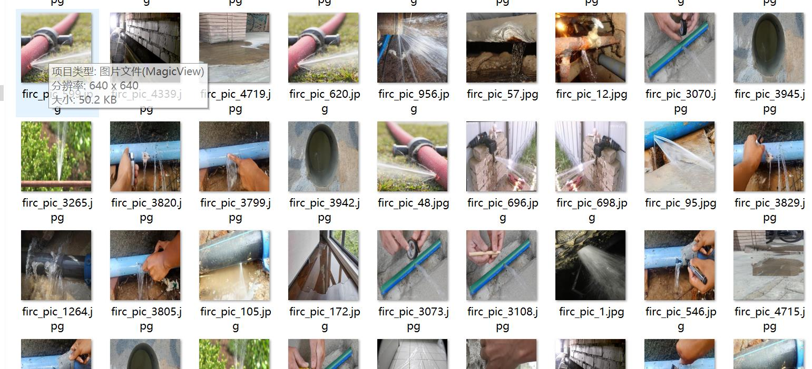
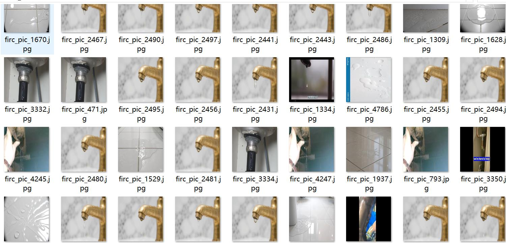
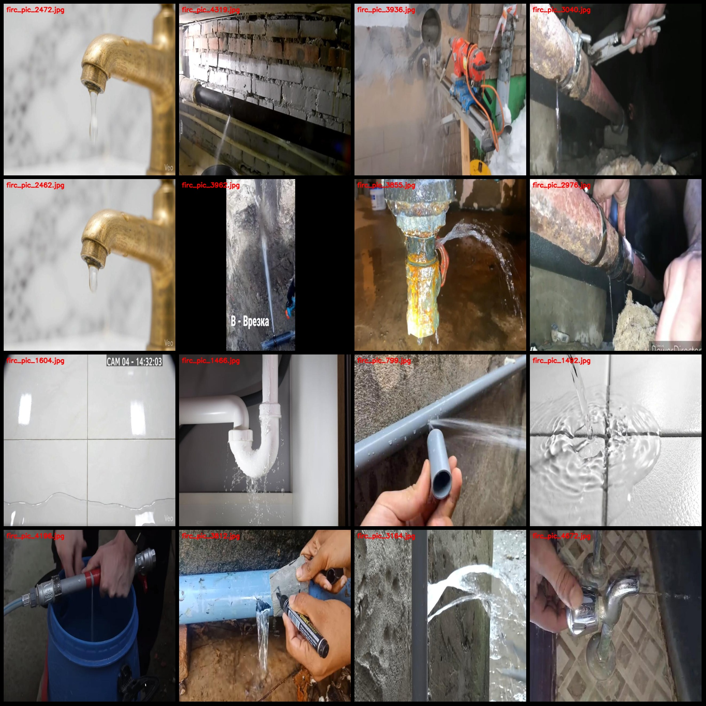
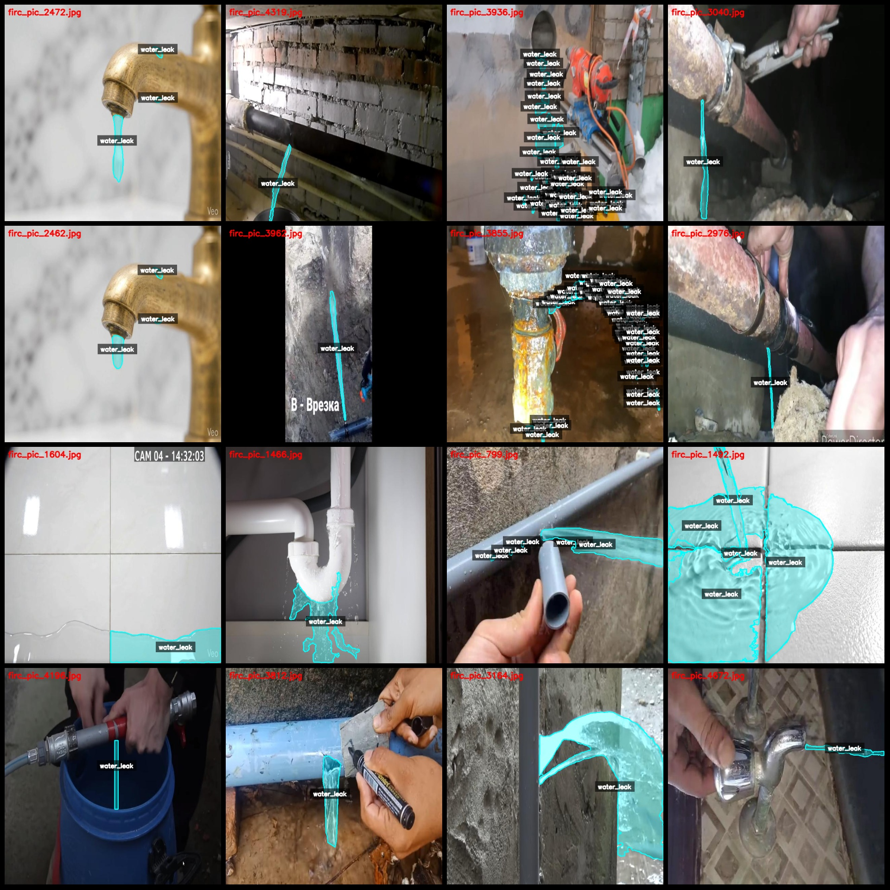
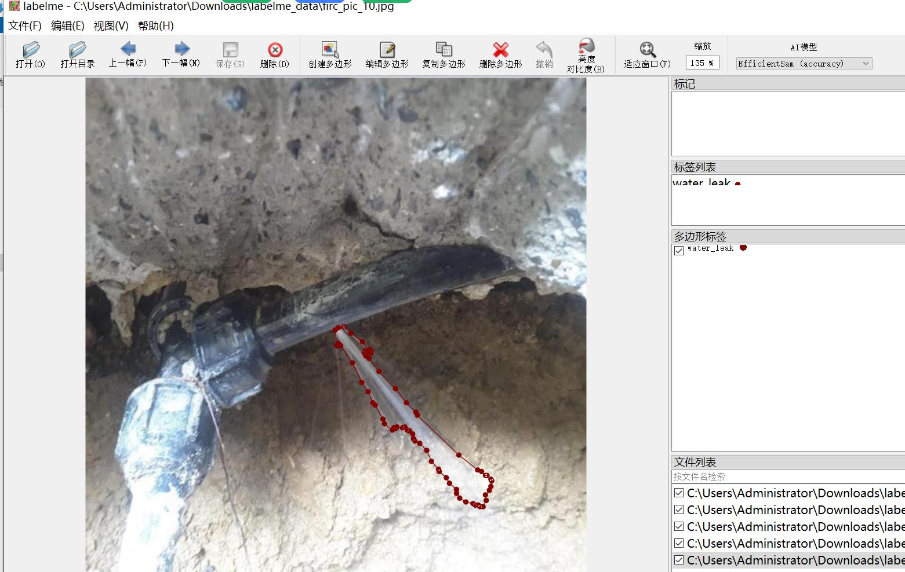

# Leakage Detection and Segmentation Data Set

## Dataset Format: LabelMe Format (Without mask files, only containing jpg images and corresponding json files)

### Image Count: Number of jpg files
- Number of jpg files: 4867

### Annotation Count: Number of json files
- Number of json files: 4867

### Classification Count: 1 Category
- Classification name: "water_leak"

### Box Count per Classification:
- Water leak count = 19679
- Total box count = 19679

### Annotation Tool: labelme=5.5.0

### Image Resolution: 640x640

### Annotation Rules: Draw polygons for the categories.

### Importance Notes: The dataset can be opened and edited with labelme. JSON datasets need to be converted into mask or Yolo format or Coco format for semantic segmentation or instance segmentation.

### Special Notice: This dataset does not guarantee the accuracy of the trained model or weight files.

### Preview of Images:

### Example of Annotation:
- Randomly selected 16 images:

### Annotation drawing results:

### Labelme editing image example:

## Images

Here is a pay link on Stripe ( https://buy.stripe.com/3cs8yP7sY87d0vu9AB ). Please contact me lonlonago@foxmail.com after funding $89, and I will send you a complete data files , thank you!

